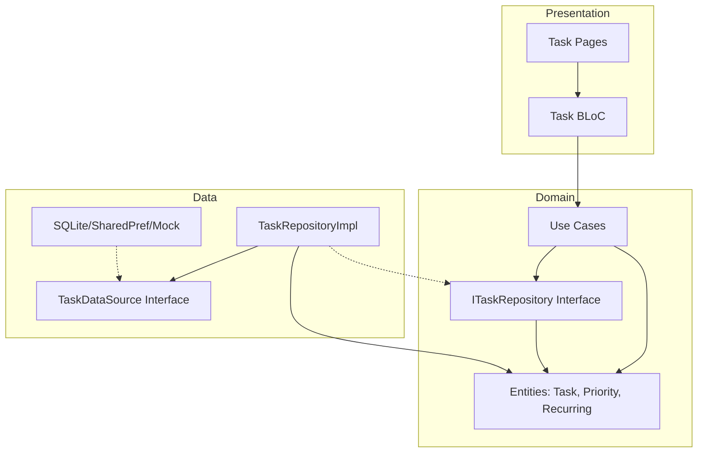

# Task Management App (SOLID & DI Implementation)

This project is a Task Management application built with Flutter, focusing on Clean Architecture, SOLID principles, and automated Dependency Injection.

## Architecture Diagram
The app follows a strict Layered Architecture (Presentation -> Domain <- Data).
1. **Domain Layer**: Contains Entities, Use Cases, and Repository Interfaces. This is the "heart" of the app and has zero dependencies on other layers.
2. **Data Layer**: Contains Repository implementations and Data Sources (Shared Preferences, Mock, Firebase).
3. **Presentation Layer**: UI Widgets and BLoC for state management.

## Dependency Injection & Service Locator
We use **GetIt** as a Service Locator and **Injectable** as the code generator.

### Why GetIt + Injectable?
* **Decoupling**: Classes don't need to know how to instantiate their dependencies.
* **Performance**: GetIt is extremely fast and doesn't rely on the Widget Tree (unlike Provider).
* **Environments**: We easily swap between `dev` (Mocks) and `prod` (SharedPref) using `@Environment` annotations.

## SOLID Principles Applied
* **Single Responsibility (SRP)**: Each UseCase (e.g., `AddTaskUseCase`) handles only one business operation.
* **Open/Closed (OCP)**: We can add a `SqliteDataSource` without changing the existing BLoC or Repository logic.
* **Liskov Substitution (LSP)**: All DataSources (Firebase, SharedPref, Mock) implement the `TaskDataSource` interface and are interchangeable.
* **Interface Segregation (ISP)**: UI components depend on high-level Repository interfaces rather than bloated implementation classes.
* **Dependency Inversion (DIP)**: High-level modules (BLoC) depend on abstractions (ITaskRepository), not low-level details (SharedPrefs).

## Testing
- **Goal**: >70% Line Coverage.
- **Tools**: `flutter_test`
- **Run Tests**: `flutter test --coverage`

